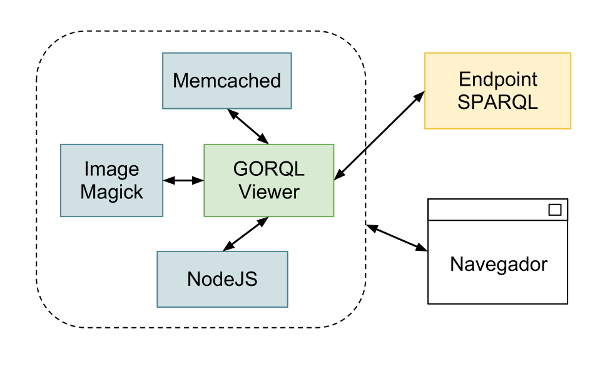

====================
Manual de despliegue
====================

Componentes
===========

Entorno de desarrollo
=====================

El proceso detallado para desplegar GORQL Viewer para un entorno
de desarrollo se encuentra en el :doc:`developer`.

Dependencias
============

NodeJS
------

NodeJS es la tecnología sobre la que se ha construido GORQL Viewer.
Se puede instalar a partir de un RPM:

*x86_64 RedHat 5*
 Descarga-NodeJS-RH5_

.. _Descarga-NodeJS-RH5: http://files.yaco.es/~ceic-ogov/dependencies/rh5/nodejs-0.6.17-1.x86_64.rpm

*x86_64 RedHat 6*
 Descarga-NodeJS-RH6_

.. _Descarga-NodeJS-RH6: http://files.yaco.es/~ceic-ogov/dependencies/rh6/nodejs-0.6.17-1.el6.x86_64.rpm

Una vez descargado el paquete se instala ejecutando (ej RH5):

.. code-block:: none

 # rpm -Uvh nodejs-0.6.17-1.x86_64.rpm

Este paquete provee NodeJS_ y NPM_ (el sistema de paquetería de NodeJS)
necesarios para el funcionamiento de GORQL Viewer.

.. _NodeJS: http://nodejs.org/
.. _NPM: http://npmjs.org/

Forever
-------

Forever_ es una utilidad que se encarga de monitorizar procesos, y relanzarlos
en caso de que se produzca algún tipo de error.

.. _Forever: https://github.com/nodejitsu/forever

Se puede instalar a partir de un RPM:

*x86_64 RedHat 5*
 Descarga-Forever-RH5_

.. _Descarga-Forever-RH5: http://files.yaco.es/~ceic-ogov/dependencies/rh5/forever-0.9.1-1.x86_64.rpm

*x86_64 RedHat 6*
 Descarga-Forever-RH6_

.. _Descarga-Forever-RH6: http://files.yaco.es/~ceic-ogov/dependencies/rh6/forever-0.9.1-1.x86_64.rpm

Una vez descargado el paquete se instala ejecutando:

.. code-block:: none

 # rpm -Uvh forever-0.9.1-1.x86_64.rpm

ImageMagick
-----------

ImageMagick se utiliza para la generación de imágenes PNG de los gráficos en
el servidor. No se provee RPM, pero normalmente está disponible en el
repositorio básico del sistema operativo. Se puede instalar haciendo uso de
yum:

.. code-block:: none

 # yum install ImageMagick

Memcached
---------

Memcached es un servidor de cache y, aunque no es una dependencia obligatoria,
sí que es muy recomendable. Si Memcached está instalado y corriendo, GORQL
Viewer hará uso de la caché para minimizar las peticiones al endpoint SparQL
agilizando mucho el funcionamiento.

Para Red Hat 5 se proporciona un RPM.

*x86_64 RedHat 5*
 Descarga-Memcached-RH5_

.. _Descarga-Memcached-RH5: http://files.yaco.es/~ceic-ogov/dependencies/rh5/memcached-1.4.5-1.el5.x86_64.rpm

Una vez descargado el paquete se instala ejecutando:

.. code-block:: none

 # rpm -Uvh memcached-1.4.5-1.el5.x86_64.rpm

Para Red Hat 6 no se provee RPM, pero normalmente está disponible en el
repositorio básico del sistema operativo. Se puede instalar haciendo uso de
yum:

.. code-block:: none

 # yum install memcached

Otros
-----

Las librerías que requiere GORQL Viewer se distribuyen en el paquete del mismo,
con lo que al instalarlo se instalan también sus dependencias.

GORQL Viewer
============

Instalación
-----------

Una vez instalado NodeJS, se puede desplegar GORQL Viewer. Para ello se utiliza el
paquete RPM:

*x86_64 RedHat 5*
 Descarga-GORQL-Viewer-RH5_

.. _Descarga-GORQL-Viewer-RH5: http://files.yaco.es/~ceic-ogov/gorql-viewer/1.2/rh5/gorql-viewer-1.2.0-4.x86_64.rpm

*x86_64 RedHat 6*
 Descarga-GORQL-Viewer-RH6_

.. _Descarga-GORQL-Viewer-RH6: http://files.yaco.es/~ceic-ogov/gorql-viewer/1.2/rh6/gorql-viewer-1.2.0-4.x86_64.rpm

Una vez descargado el paquete se instala ejecutando:

.. code-block:: none

 # rpm -Uvh gorql-viewer-1.2.0-4.x86_64.rpm

Este paquete incluye GORQL Viewer y todas las librerías que utiliza, y crea un
script de servicio para el arranque y parada del servidor.

Los contenidos del paquete se despliegan en `/opt/gorql-viewer/`. Los logs se
encuentran en `/opt/gorql-viewer/.forever/`.

El servidor escucha, con la configuración por defecto, en el **puerto 3000**.
La configuración del mismo se encuentra en el fichero `settings.js` en el
directorio `/etc/gorql-viewer/`.

Actualización
-------------

La actualización de GORQL Viewer a nuevas versiones es muy sencilla, dado que
el componente no mantiene un estado. Simplemente hay que actualizar el rpm:

.. code-block:: none

 service gorql-viewer stop
 rpm -Uvh gorql-viewer-X.Y.Z-W.x86_64.rpm
 service gorql-viewer start

Obviamente hay que sustituir X, Y, Z y W por los números de versión
correspondientes.

Con estos comandos queda actualizado el visor.

.. note:: Si se modifica la configuración en algo que afecte a las consultas
   SPARQL, por ejemplo el *endpoint*, entonces hay que reiniciar el
   memcached (si se está usando) para que dichos cambios tengan efecto
   inmediatamente.

Gestión del servicio
--------------------

Gracias al script de servicio *gorql-viewer* es muy sencillo gestionar el
**arranque**, **parada** y **monitorización** del servidor. Para ello tan sólo
hemos de invocar al servicio con el argumento *start*, *stop* o *status*,
respectivamente.

Para la gestión de este servicio se utiliza Forever_ que se encarga de que el
servidor se relance en caso de que ocurra algún problema.

*Ejemplos de salida*

.. code-block:: none

 # service gorql-viewer start
 info:   Forever processing file: /opt/gorql-viewer/app.js

.. code-block:: none

 # service gorql-viewer stop
 info:   Forever stopped process:
 data:       uid  command script                 forever pid  logfile                           uptime
 data:   [0] ekL8 node    /opt/gorql-viewer/app.js 8101    8102 /opt/gorql-viewer/.forever/ekL8.log 0:0:40:0.5

.. code-block:: none

 # service gorql-viewer status
 info:   Forever processes running
 data:       uid  command script                 forever pid  logfile                           uptime
 data:   [0] ekL8 node    /opt/gorql-viewer/app.js 8101    8102 /opt/gorql-viewer/.forever/ekL8.log 0:0:39:15.924

Configuración
-------------

La configuración del visor se encuentra en el directorio `/etc/gorql-viewer/`.

settings.js
~~~~~~~~~~~

Éste es el fichero principal de configuración de GORQL Viewer. Incluye
tres grupos de parámetros: *global*, *development* y *production*. Que son
opciones globales para todos los casos, específicas para entornos de desarrollo,
y específicas para entornos de producción, respectivamente.

El formato es JSON. Las opciones de desarrollo y producción son las mismas, se
utiliza un grupo u otro según se arranque el visor en un modo u otro.

El fichero trae una configuración de ejemplo.

Global
''''''

 - **staticUrl**: Ruta donde se sirven los ficheros estáticos, sólo es necesario
   modificar este parámetro si se desea servir los ficheros estáticos por
   separado. Por defecto, *"../"*.
 - **debug**: Modo depuración, para el funcionamiento normal debe estar
   desactivado. Por defecto, *false*.
 - **port**: Puerto en el que escucha el visor. Por defecto, *3010*.
 - **host**: Dominio en el que se sirve la aplicación. Por defecto,
   *http://gorql-viewer.ceic-ogov.yaco.es*.

Development y Production
''''''''''''''''''''''''

Por defecto, si se arranca el visor mediante el script de servicio, el modo
utilizado es *Production*.

Las siguientes son opciones de la plataforma, el usuario final no podrá escoger
valores diferentes a los que el administrador haya configurado aquí:

 - **sparqlEndpoint**: Url del servidor al que se le realizan las consultas en
   SparQL. Por ejemplo, *'http://dbpedia.org/sparql'*.
 - **memcachedServer**: Url del servidor memcached, incluye el puerto. Por
   ejemplo, *'localhost:11211'*.
 - **memcachedLifetime**: Tiempo en segundos que memcached mantiene los datos.
   Por ejemplo, *1800*, que correspondería a media hora.

El resto de opciones son los valores por defecto que toman los parámetros de
los diferentes tipos de gráficos si el usuario no los especifica. Es decir, que
está configuración puede ser sobreescrita por el usuario final mediante
parámetros en la url de consulta:

 - **bar**:

   - **sizeX**: Ancho en píxeles del gráfico.
   - **sizeY**: Alto en píxeles del gráfico.
   - **landscape**: Valor booleano que determina si el gráfico se debe representar
     en horizontal.

 - **pie**:

   - **sizeX**: Ancho en píxeles del gráfico.
   - **sizeY**: Alto en píxeles del gráfico.
   - **sizeHighlight**: Número de píxeles que se desplaza hacia afuera un sector
     al ser resaltado con el cursor.

 - **line**:

   - **sizeX**: Ancho en píxeles del gráfico.
   - **sizeY**: Alto en píxeles del gráfico.
   - **area**: Valor booleano que determina si el área comprendida debajo de las
     líneas se debe colorear.

 - **timeline**:

   - **sizeX**: Ancho en píxeles del gráfico.
   - **sizeY**: Alto en píxeles del gráfico.
   - **detailRes**: Resolución temporal de la banda con la vista detallada.
     :ref:`Posibles valores. <simile-chart>`
   - **overviewRes**: Resolución temporal de la banda con la vista resumen.
     :ref:`Posibles valores. <simile-chart>`

 - **map**:

   - **sizeX**: Ancho en píxeles del gráfico.
   - **sizeY**: Alto en píxeles del gráfico.

 - **mapea**:

   - **sizeX**: Ancho en píxeles del gráfico.
   - **sizeY**: Alto en píxeles del gráfico.

.. note:: Si se modifica la configuración en algo que afecte a las consultas
   SPARQL, por ejemplo el *endpoint*, entonces hay que reiniciar el
   memcached (si se está usando) para que dichos cambios tengan efecto
   inmediatamente.
